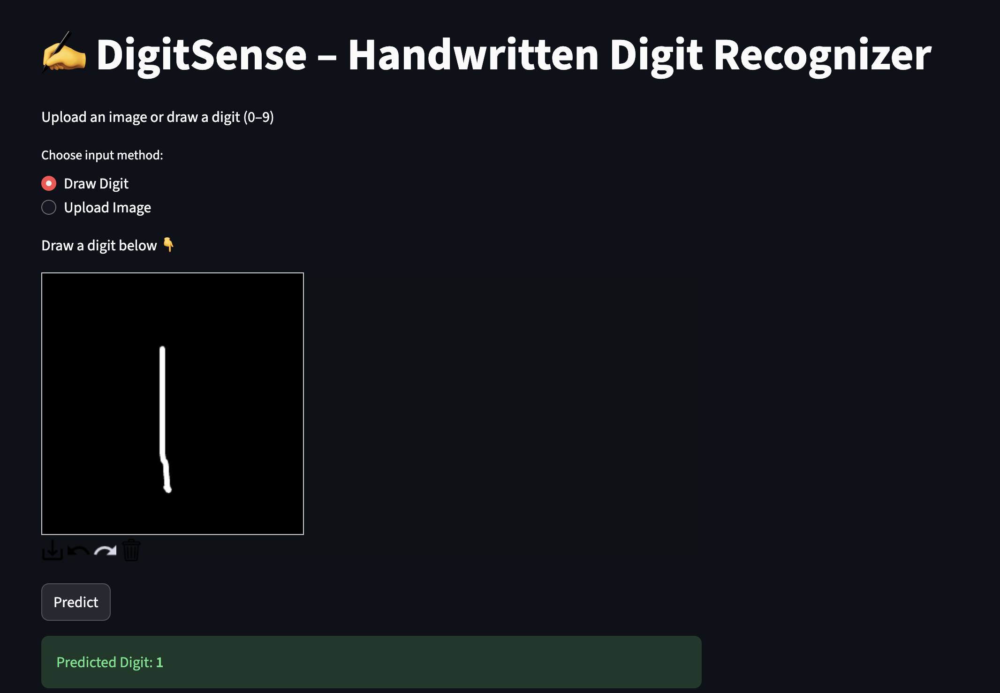
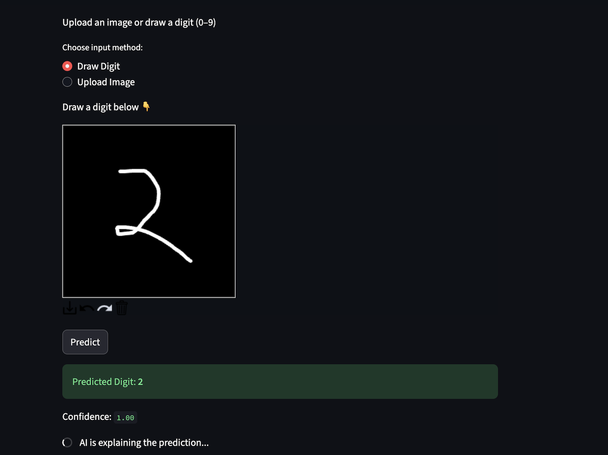
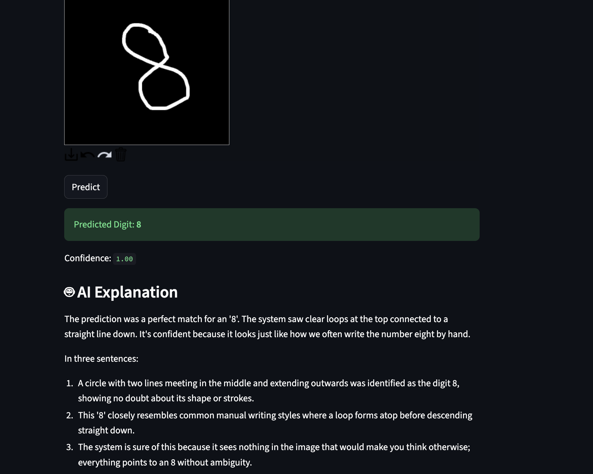
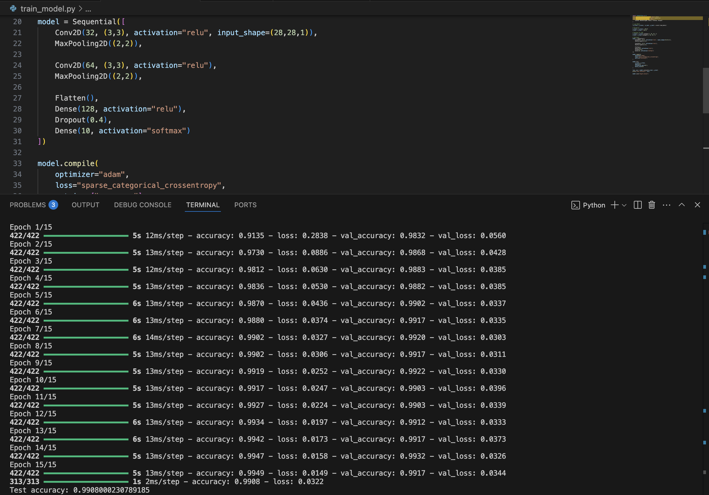

# ✍️ DigitSense – LLM Explainable Handwritten Digit Recognizer

DigitSense is an AI-powered handwritten digit recognition system enhanced with **LLM-based explainability**.  
It combines a **CNN trained on MNIST** with **LangChain + Ollama (local LLM)** to not only predict digits (0–9) but also **explain the prediction in natural language**.

🔍 This project focuses on **model interpretability**, **GenAI integration**, and **human-friendly AI explanations**.

---

## 🚀 Live Demo

🔗 **Live Application:**  
👉 https://digitsense-handwritten-digit-recognizer.streamlit.app/

> ⚠️ **Note**  
> The live Streamlit demo showcases **digit recognition only**.  
> LLM-based explanations run **locally** using Ollama and are not supported on Streamlit Cloud.

---

## 🧠 Key Features

- ✏️ Draw digits directly on a canvas
- 📤 Upload handwritten digit images
- 🤖 CNN-based digit prediction (MNIST-trained)
- 🧠 LLM-powered explanation using LangChain
- 🗣️ Natural language reasoning
- 💻 Fully local GenAI (no OpenAI API key required)

---

## 🏗️ Architecture

User Input → Preprocessing → CNN → Prediction → LangChain → Ollama → Explanation

---

## 🛠️ Tech Stack

**ML:** TensorFlow, Keras, NumPy  
**GenAI:** LangChain, Ollama  
**Frontend:** Streamlit  

---

## 📸 Screenshots

### 🖌️ Digit Drawing & Prediction


### ✏️ AI Explaination Process


### 🤖 LLM-Based Explanation Output


### 📊 Model Accuracy & Training Metrics


---

## ⚙️ Local Setup

```bash
git clone https://github.com/Dhananjay0719/digitsense-llm-explainer.git
cd digitsense-llm-explainer
conda create -n digit-ai python=3.11 -y
conda activate digit-ai
pip install -r requirements.txt
ollama pull phi3
ollama serve
streamlit run app.py